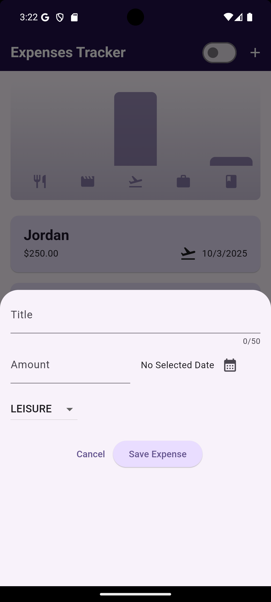
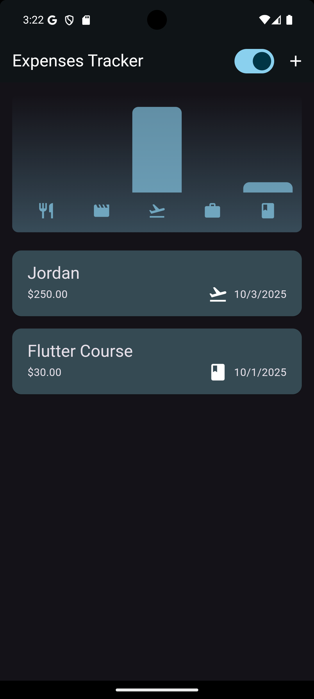
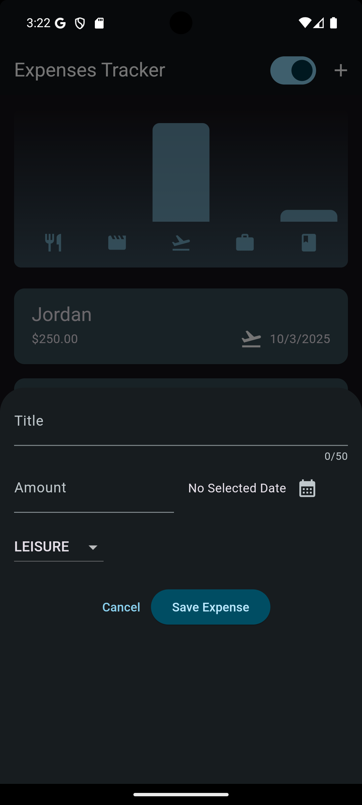

# 💰 Flutter Expense Tracker App

The **Expense Tracker App** is a Flutter-based mobile application designed to help users manage their personal expenses efficiently.  
It allows users to **add, delete, categorize, and visualize** expenses through an interactive and responsive user interface.  
The app supports both **light and dark modes**, and adapts to different screen sizes (phone/tablet, portrait/landscape).

---

## 📱 Overview
- 🛠️ **Technologies:** Flutter, Dart, Material Design, Cupertino, intl, uuid

- 📅 **Developed:** July 2024  

---

## ✨ Features
- ➕ **Add & Delete Expenses** with title, amount, date, and category.
- 🏷️ **Categorization** into five groups: Food, Travel, Leisure, Work, and Learning.
- 📊 **Interactive Chart** showing total spending per category.
- 📱 **Responsive Layout** for phones (portrait) and tablets (landscape).
- 🌙 **Light/Dark Theme Switching**.
- ✅ **Input Validation** with error dialogs (Material for Android / Cupertino for iOS).
- 🔄 **Undo Deletion** with Snackbar.
- 🧩 **Cross-Platform Support** (Android & iOS).

---

## 🧠 File Structure & Functionality

### `main.dart`
- Entry point of the app.
- Runs `Start()` widget which initializes themes and main layout.

### `start.dart`
- Manages theme (light/dark) and global color schemes.
- Defines `ThemeMode` state and passes it to the main app.
- Uses `Expenses` as the home screen.

### `expenses.dart`
- Main screen combining the **chart** and the **expenses list**.
- Handles adding and deleting expenses, with `SnackBar` for undo.
- Adapts layout based on screen width (column vs. row layout).

### `chart.dart`
- Displays a bar chart showing total expenses by category.
- Normalizes bar height based on the max expense amount.
- Integrates with `ChartBar` and uses icons for categories.

### `chart_bar.dart`
- Renders a single bar within the chart.
- Adjusts fill height based on expense ratio.

### `expenses_list.dart`
- Scrollable list of expense cards using `ListView.builder`.
- Supports swipe-to-delete with confirmation.

### `expense_item.dart`
- Displays one expense inside a card with title, amount, date, and icon.

### `new_expense.dart`
- Opens a modal form for adding a new expense.
- Chooses between two layouts: `width_orientation` or `height_orientation` based on screen width.

### `width_orientation.dart` & `height_orientation.dart`
- Two responsive forms for adding expenses:
  - **Width** for tablets (horizontal layout).
  - **Height** for phones (vertical layout).
- Validate input (title not empty, amount > 0, date selected).

### `expense.dart`
- Defines the `Expense` model and `Category` enum.
- Generates unique IDs using `uuid`.
- Formats dates with `intl`.
- Includes `ExpenseBucket` to group expenses by category.

### `switch_button.dart`
- Switch to toggle between light and dark themes.

---

## 🧩 Workflow
1. **App starts** from `main.dart` → runs `Start()` → loads `Expenses` screen.
2. **Expenses screen** displays chart + list of expenses.
3. User clicks **"+"** → opens `NewExpense` modal.
4. **Validation** occurs; if successful, new expense is added.
5. **Chart updates** dynamically.
6. **Delete** by swiping → Undo via Snackbar.
7. **Switch theme** using toggle button.

---

## ⚙️ Technologies Used
- Flutter / Dart  
- Material Design & Cupertino Widgets  
- intl (date formatting)  
- uuid (unique IDs)  
- Stateful Widgets for state management  

---

## 🖼️ Screenshots
- Light Theme
  | Home Screen | Add Expense |
  |-------------|-------------|
  |  | 
  
- Dark Theme
  | Home Screen | Add Expense |
  |-------------|-------------|
  |  | 
